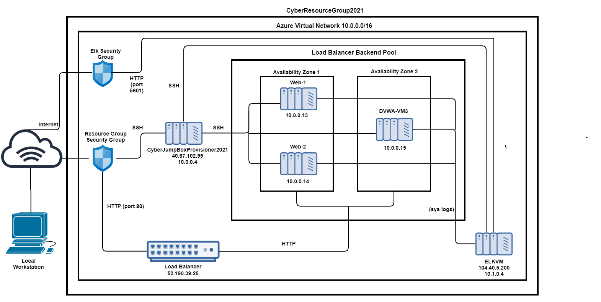
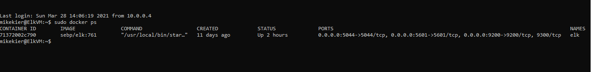

# ProjectAzure
## Automated ELK Stack Deployment

The files in this repository were used to configure the network depicted below.

These files have been tested and used to generate a live ELK deployment on Azure. They can be used to recreate the entire deployment pictured above. Alternatively, select portions of the install-elk.yml file may be used to install only certain pieces of it, such as Filebeat.

  - install-elk.yml

This document contains the following details:
- Description of the Topology
- Access Policies
- ELK Configuration
  - Beats in Use
  - Machines Being Monitored
- How to Use the Ansible Build

***

### Description of the Topology

The main purpose of this network is to expose a load-balanced and monitored instance of DVWA, the D*mn Vulnerable Web Application.

Load balancing ensures that the application will be more consistent and dependable for the end-user employees, in addition to restricting access to the network. The load balancer and jump box elements of the network disburse traffic to different servers in the resource pool to ensure that no single server becomes overworked and subsequently unreliable.

Integrating an ELK server allows users to easily monitor the vulnerable VMs for changes to the log data and system metrics. We can collect and monitor log data and metrics about the health of the system to proactively address any issues before they impact the end-user.

The configuration details of each machine may be found below:

| Name                        | Type                    | Function          | IP Address | Location | Operating System |
|-----------------------------|-------------------------|-------------------|------------|----------|------------------|
| CyberJumpBoxProvisioner2021 | Jump Box with Container | Gateway           | 10.0.0.4   | East     | Linux            |
| Web-1                       | VM                      | Local Machine     | 10.0.0.13  | East     | Linux            |
| Web-2                       | VM                      | Local Machine     | 10.0.0.14  | East     | Linux            |
| DVWA-VM3                    | VM                      | Testing           | 10.0.0.15  | East     | Linux            |
| ELKVM                       | VM                      | System Monitoring | 10.1.0.4   | West     | Linux            |

***

### Access Policies

The machines on the internal network (Web-1, Web-2 and DVWA-VM3) are not exposed to the public Internet. 

Only the Jump Box and the ELKVM can accept connections from the Internet. Access to these machines is only allowed from the following IP address which is my home IP: 73.50.96.196 

Machines within the network can only be accessed by the Jump Box and the ELKVM.

A summary of the access policies in place can be found in the table below:

| Name     | IP        | Publicly Accessible | Allowed Network IP Addresses              |
|----------|-----------|---------------------|-------------------------------------------|
| Jump Box | 10.0.0.4  | Yes (restricted)    | 10.0.0.13, 10.0.0.14, 10.0.0.15, 10.1.0.4 |
| Web-1    | 10.0.0.13 | No                  | 10.0.0.4, 10.1.0.4                        |
| Web-2    | 10.0.0.14 | No                  | 10.0.0.4, 10.1.0.4                        |
| DVWA-VM3 | 10.0.0.15 | No                  | 10.0.0.4, 10.1.0.4                        |
| ELKVM    | 10.1.0.4  | Yes (restricted)    | 10.0.0.13, 10.0.0.14, 10.0.0.15, 10.0.0.4 |

***

### Elk Configuration

Ansible was used to automate configuration of the ELK machine. No configuration was performed manually, which is advantageous because it ensures scalability, consistency, and reliability of your IT environment. That is, through the use of automation, we can scale up your environment to whatever level you need in a relatively short amount of time while also ensuring deployment and configuration consistency across all your servers as well as keep them up-to-date.

The Elk installation playbook implements the following tasks:
* Installs the Docker and python3-pip packages
* Increases the allocated system memory to ensure Docker runs
* Downloads the Docker image
* Downloads and launches a Docker ELK container
* Starts the container
* Enables the Docker service on boot so if you restart your ELK VM, the docker service starts up automatically

The following screenshot displays the result of running `docker ps` after successfully configuring the ELK instance.

***

### Target Machines & Beats
This ELK server is configured to monitor the following machines:
* 10.0.0.13
* 10.0.0.14
* 10.0.0.15

We have installed the following Beats on these machines:
* Filebeat
* Metricbeat

These Beats allow us to collect various logs and metrics concerning each machine in the network such as data about the file system, including which files changed and when, and machine metrics such as uptime, CPU and memory usage.  This is useful information because together with Kibana, it enables us to detect whether an attack is occurring or has occurred.  

***

### Using the Playbook
In order to use the playbook, you will need to have an Ansible control node already configured. Assuming you have such a control node provisioned: 

SSH into the control node and follow the steps below:
- Copy the install-elk.yml file to the /etc/ansible/ directory of the Ansible container.
- Update the hosts file in the /etc/ansible/ directory on the Ansible VM using the command `nano /etc/ansible/hosts` to (1) designate a group of VMs that you want the playbook to run on, (2) put the IP address of the VM(s) on which you would like to install ELK in the group, and (3) specify python3 with the code `ansible_python_interpreter=/usr/bin/python3`.
- Run the playbook using the command `ansible-playbook /etc/ansible/install-elk.yml`, and navigate to the ELK server to check that the installation worked as expected by running the command `docker ps`.
